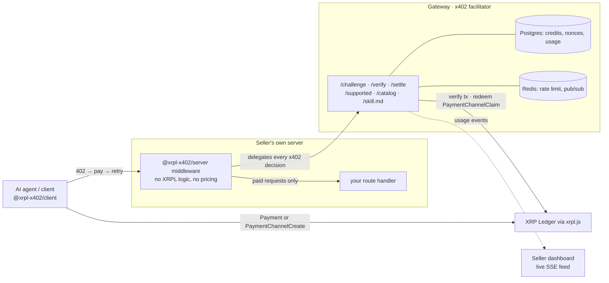
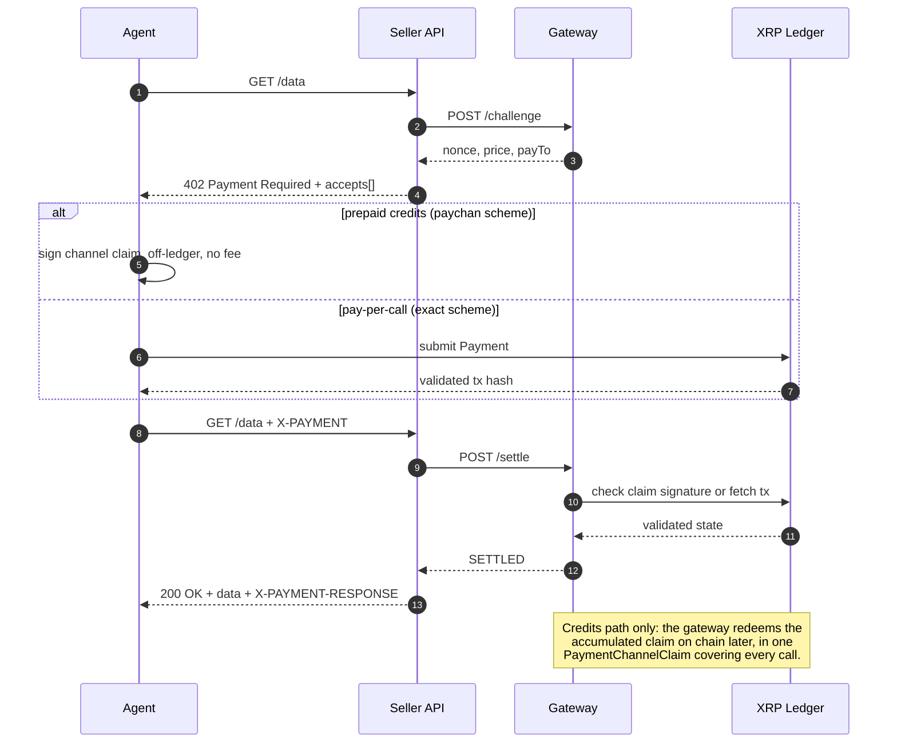

# x402 on XRPL

An open, self-hostable **x402 facilitator** for the XRP Ledger, plus the server
and client SDKs around it. It lets any HTTP API charge **per call** in **XRP** or
**RLUSD** over the [x402 protocol](https://github.com/coinbase/x402), with no
payment processor, no API keys, and no sign-up.

This is an XRPL port of Coinbase's x402 (originally Base/USDC). The gateway is
the x402 facilitator, exposing `/verify` and `/settle`. Callers pay either with a
direct XRPL `Payment` (pay-per-call) or with off-ledger **Payment Channel
(PayChan)** claims (prepaid credits), the XRPL-native analog of Base's EIP-3009
signed authorizations.

The motivating use case is autonomous **AI agents**, which cannot sign up for a
payment processor but can hold an XRPL wallet and pay per call. Any deployment
serves its own agent-facing protocol guide at `GET /skill.md`, so an agent can
learn to pay by fetching one document from the gateway it is paying.

Live deployment: [xrplfi.com](https://xrplfi.com) (dashboard),
`api.xrplfi.com` (facilitator).

> **Status:** v0.1. The packages are not published to npm yet. Testnet and
> mainnet are both served; treat mainnet use as early software and start small.

## Contents

- [How it works](#how-it-works) and [the two payment modes](#two-payment-modes)
- [Running the gateway](#running-the-gateway)
- [Metering an API](#metering-an-api-sellers) (sellers) and
  [paying for one](#paying-for-an-api-clients-and-agents) (clients)
- [x402 v1 spec compliance](#x402-v1-spec-compliance)
- [Configuration](#configuration)

## How it works

Three parties and the ledger. The seller keeps their own API; the gateway holds
the x402 protocol logic; the ledger is the only source of truth about money.



The seller's API stays in the seller's hands. The middleware answers `402` for
unpaid requests and lets paid ones through, delegating every x402 decision to the
gateway. Because payment is enforced _inside_ the seller's server, there is no
separate unmetered origin URL to leak or bypass.

### One paid request, end to end



### Two payment modes

**Pay-per-call.** The client submits a direct XRPL `Payment` for the exact price
and the gateway verifies it on-ledger. One on-chain transaction per call.

**Prepaid credits (PayChan).** The client opens one Payment Channel, then makes
many **off-ledger** metered calls by sending monotonically increasing signed
claims. Credits tick down with no per-call on-chain wait, and the gateway redeems
the channel on chain later. This is the fast path for agents: it turns N paid
calls into 2 on-chain transactions, which is what makes per-call pricing at a
fraction of a cent viable.

Each seller picks a **payment setup** at registration (`PAY_PER_CALL`,
`PREPAID_CREDITS`, or `BOTH`). The 402 `accepts[]` advertises one entry per
allowed mode, and the gateway enforces the setup end to end: settles in a
disallowed mode are rejected, and channels cannot be opened against a
pay-per-call-only seller. Credit setups require XRP pricing, because PayChan is
XRP-native.

### Known limitations

PayChan gives x402's _shape_ on XRPL, not EIP-3009's _economics_. Two
consequences to plan around:

**Per-seller capital lockup.** An EIP-3009 authorization draws on one fungible
USDC balance; a PayChan channel is per (payer, destination) and must be funded on
chain up front. An agent calling many sellers opens, and locks capital in, a
channel per seller. The first call to a new seller still costs an on-chain
channel open or a pay-per-call.

**RLUSD has no off-ledger fast path.** PayChan is XRP-native, so prepaid credits
are XRP-only. RLUSD pricing works only via pay-per-call, one on-chain settlement
per call. Stable-unit pricing and the off-ledger fast path are mutually exclusive
today.

The gateway does guard the credits path: it rejects channels whose `SettleDelay`
or `CancelAfter` leave too little runway to redeem, stops honoring claims near
expiry, and auto-redeems on chain as a channel fills. Delivered value is always
pulled before a channel can be closed and its deposit reclaimed.

## Monorepo layout

pnpm workspaces, TypeScript (NodeNext, strict).

| Package             | Role                                                             |
| ------------------- | ---------------------------------------------------------------- |
| `@app/shared`       | Types, enums, constants, x402 payload schemas (zod), `loadEnv()` |
| `@app/gateway`      | Node/Fastify gateway service: x402 facilitator + dashboard API   |
| `@xrpl-x402/client` | `x402fetch` plus wallet, payment, and channel helpers            |
| `@xrpl-x402/server` | Express + Fastify middleware (delegates to the gateway)          |
| `@app/dashboard`    | Vite + React seller dashboard                                    |

## Running the gateway

Prerequisites: **Node ≥ 20**, **pnpm**, and reachable **Postgres** + **Redis**.

```bash
pnpm install
cp .env.example .env                  # then edit values (see Configuration)
make up                               # optional: Postgres + Redis via docker compose
pnpm migrate:up
pnpm build
pnpm --filter @app/gateway start      # gateway on :8402
pnpm --filter @app/dashboard dev      # dashboard on :5173
```

Confirm it is live and serving both networks:

```bash
curl -s localhost:8402/supported
```

That lists four kinds: `exact` and `paychan`, on `xrpl-testnet` and `xrpl`.
`GET /catalog` returns the public registry of every API registered on the
deployment, and `GET /skill.md` returns the agent-facing protocol guide.

## Metering an API (sellers)

Register your API in the dashboard (price, asset, payout address, payment setup,
networks), then put the middleware in front of the routes you want to charge for.
Pricing is deliberately **not** repeated in middleware config: the gateway
registration is the single source of truth.

```ts
import express from 'express';
import { x402Express } from '@xrpl-x402/server';

const app = express();

app.use(
  '/data',
  x402Express({
    gatewayUrl: 'https://api.xrplfi.com',
    sellerId: '<your-seller-id>',
  }),
);

app.get('/data', (_req, res) => res.json({ answer: 42 }));
```

Unpaid requests get a spec-shaped `402` carrying the payment requirements. Paid
ones reach your handler with an `X-PAYMENT-RESPONSE` header attached.

## Paying for an API (clients and agents)

`x402fetch` is a drop-in `fetch` that handles the 402, pays it, and retries:

```ts
import { Client, Wallet } from 'xrpl';
import { x402fetch, openChannel, readSettlement } from '@xrpl-x402/client';

const client = new Client('wss://s.altnet.rippletest.net:51233');
await client.connect();
const wallet = Wallet.fromSeed(process.env.XRPL_SEED!);

// Pay-per-call: one on-chain Payment per request.
const res = await x402fetch('https://seller.example.com/data', {
  x402: { wallet, client, sourceTag: 0, maxAmount: { XRP: '0.05' } },
});
console.log(await res.json(), readSettlement(res)?.transaction);

// Prepaid credits: open one channel, then pay off-ledger per call.
const channel = await openChannel({
  client,
  wallet,
  destination: '<channelDestination from GET /catalog>',
  deposit: '1',
  sourceTag: 0,
});

for (let i = 0; i < 100; i++) {
  await x402fetch('https://seller.example.com/data', {
    x402: { wallet, client, sourceTag: 0, channel },
  });
}
```

Register the channel with the gateway (`POST /channels`) before its claims are
honored. `maxAmount` is a per-call ceiling: a challenge above it throws rather
than paying.

Agents that would rather speak the wire protocol directly, with no SDK, should
fetch `GET /skill.md` from the gateway. It documents the full protocol plus the
XRPL wallet handling discipline to pay safely.

## x402 v1 spec compliance

Every wire message follows the
[x402 v1 specification](https://github.com/coinbase/x402/blob/main/specs/x402-specification-v1.md).
XRPL is carried as two payment schemes on the `xrpl` / `xrpl-testnet` networks:

| Spec primitive                                 | This implementation                                                                                                                          |
| ---------------------------------------------- | -------------------------------------------------------------------------------------------------------------------------------------------- |
| `402` body `{ x402Version, error, accepts[] }` | Same, with every required `PaymentRequirements` field. The challenge nonce and RLUSD issuer ride in `extra`                                  |
| `scheme`                                       | `exact` is a direct XRPL `Payment` proven by tx hash; `paychan` is an off-ledger signed PayChan claim                                        |
| `network`                                      | `xrpl` (mainnet) / `xrpl-testnet` (CAIP-2 ids `xrpl:0` / `xrpl:1` reserved for the v2 transport)                                             |
| `X-PAYMENT`                                    | Spec envelope `{ x402Version, scheme, network, payload }`, base64 JSON; `payload` is scheme-defined                                          |
| `X-PAYMENT-RESPONSE`                           | Spec `SettlementResponse`, plus a non-spec `explorerUrl` convenience field                                                                   |
| `POST /verify`, `POST /settle`                 | Spec bodies `{ x402Version, paymentPayload, paymentRequirements }`; spec responses `{ isValid, invalidReason?, payer }` and `{ success, … }` |
| `GET /supported`                               | `{ kinds: [{ x402Version, scheme, network }] }` for both schemes on every served network                                                     |

One non-spec convenience endpoint exists: `POST /challenge`, which the server
middleware uses to have the gateway issue nonce-bound challenges (replay
protection is anchored in the gateway's single-use nonce ledger). Spec clients
never call it and only ever see spec-shaped messages.

Two more endpoints round out the surface: `GET /catalog`, the public service
registry (name, price, modes, `channelDestination`) so agents can discover what
is payable, and `GET /skill.md`, the agent protocol guide (aliased at
`/llms.txt`).

## Dashboard

Auth is **sign-in-with-XRPL**: connect a browser wallet (GemWallet, Crossmark,
Xaman, WalletConnect via
[xrpl-connect](https://github.com/XRPL-Commons/xrpl-connect)) and sign a one-time
challenge. No transaction is submitted, no fees are charged, and the seed never
leaves the wallet. GemWallet and Crossmark need zero config; Xaman needs
`VITE_XAMAN_API_KEY` and WalletConnect needs `VITE_WALLETCONNECT_PROJECT_ID`.

- **My APIs**: register APIs and watch live revenue, usage, and the settlement
  feed, scoped to your signed-in address.
- **My Bots**: configure self-custody paying agents (seller, spend caps, deposit)
  and download a ready-to-run `.env`. The bot seed stays with you; the gateway
  stores only the config and the bot's public address.

## Configuration

Copy `.env.example` to `.env`. Key vars:

| Var                       | Purpose                                                                                                                                                                         |
| ------------------------- | ------------------------------------------------------------------------------------------------------------------------------------------------------------------------------- |
| `GATEWAY_XRPL_SEED`       | Gateway wallet seed, covering both networks (one seed, same address on each). `GATEWAY_XRPL_SEED_<NETWORK>` overrides it for a different wallet per network                     |
| `AUTH_SECRET`             | Signs dashboard session tokens (≥ 16 chars)                                                                                                                                     |
| `DATABASE_URL`            | Postgres: durable ledger, usage, sellers                                                                                                                                        |
| `REDIS_URL`               | Redis: rate limit, sign-in challenges, live-feed pub/sub                                                                                                                        |
| `SOURCE_TAG`              | Stamped on every gateway-submitted XRPL tx, so its on-chain activity is attributable                                                                                            |
| `GATEWAY_PORT`            | Gateway HTTP port (default `8402`)                                                                                                                                              |
| `DASHBOARD_ORIGIN`        | Allowed dashboard origin (CORS)                                                                                                                                                 |
| `XRPL_ENDPOINT_<NETWORK>` | Override that network's WebSocket endpoint (optional)                                                                                                                           |
| `RLUSD_ISSUER_<NETWORK>`  | Override that network's RLUSD issuer (optional; Ripple's are built in)                                                                                                          |
| `PLATFORM_FEE_BPS`        | Platform fee in basis points on the credits path (default `0`, off). When set, channels open to the gateway, which redeems on chain and forwards the seller's cut minus the fee |
| `ESCROW_ENABLED`          | Custodial escrow-credits fallback (default `false`; the native path is PayChan)                                                                                                 |

### Mainnet and testnet together

Every deployment serves both. Each network needs a funded gateway wallet
(`GATEWAY_XRPL_SEED` covers both, or use per-network overrides), and each seller
chooses its own networks at registration, so the 402 `accepts[]` offers one group
of entries per network. Users toggle networks in the dashboard.

The network is bound to the challenge nonce (one challenge row per network), so
settle resolves the ledger from persisted state rather than config, and a free
testnet payment can never satisfy a mainnet challenge. See
[`MAINNET.md`](MAINNET.md).

## Development

```bash
pnpm build              # build all packages
pnpm typecheck          # typecheck all packages
pnpm lint               # eslint
pnpm format             # prettier --write
pnpm migrate:up         # apply migrations
pnpm migrate:down       # roll back one migration
pnpm audit:source-tag   # verify every gateway-submitted tx carries SOURCE_TAG
```

Conventions and architecture notes are in [`AGENTS.md`](AGENTS.md); deployment
notes are in [`docs/railway.md`](docs/railway.md).

Every transaction the gateway submits carries the configured `SOURCE_TAG`.
`pnpm audit:source-tag` verifies that from the ledger rather than from
application logs: it scans the gateway wallet's recent transactions on every
served network and exits non-zero if any gateway-submitted transaction is missing
the tag.

## License

[MIT](LICENSE).
